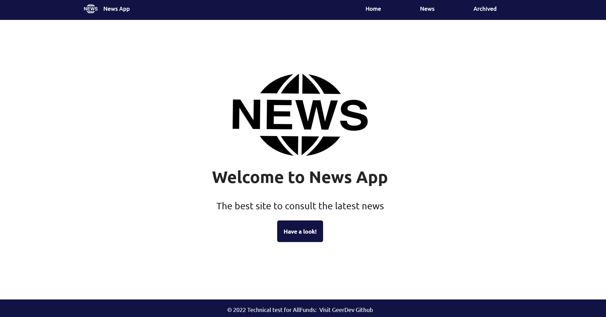
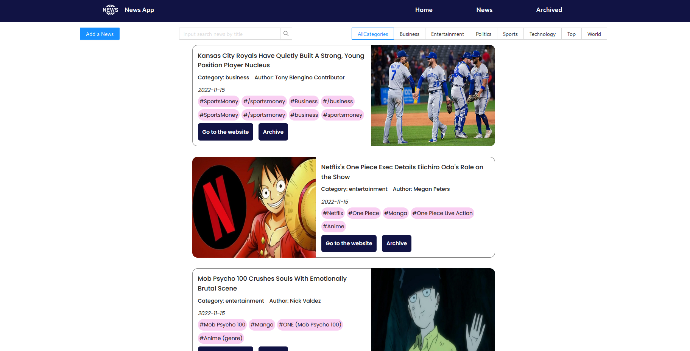
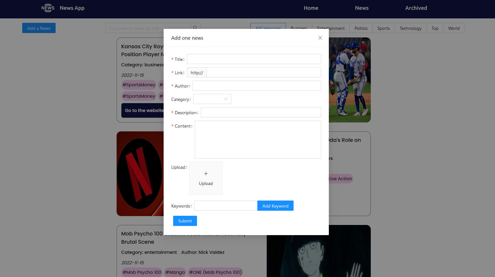
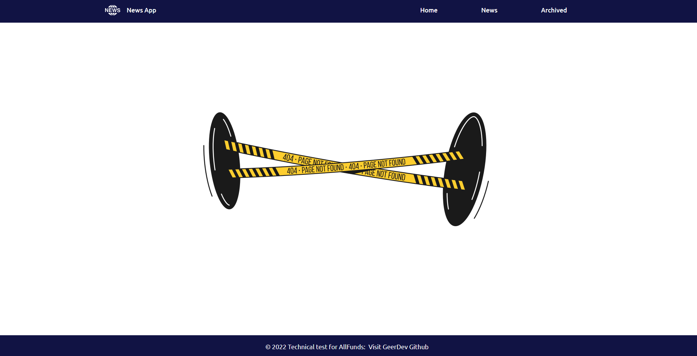
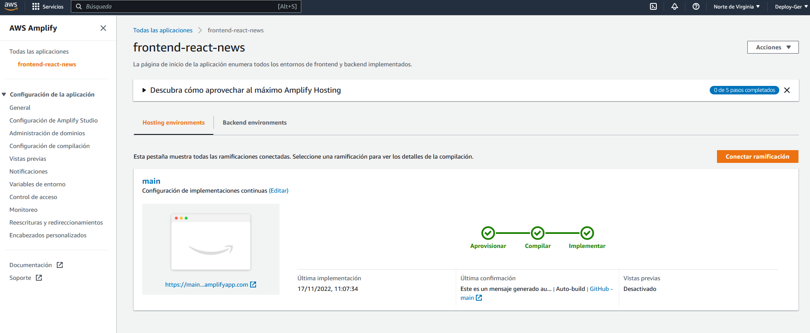

# Front-End App News

_Front creado con React que emula una web de noticias de actualidad_

## Tecnologias utilizadas 🚀

El proyecto ha sido desarrollado utilizando los siguientes paquetes:

* Axios
* React-redux
* React-redux toolkit
* React router dom
* Antd
 
## ¿Como desplegar el proyecto en local? 📋
Estas instrucciones te permitirán obtener una copia del proyecto en funcionamiento en tu máquina local para propósitos de desarrollo:

Clonarte el repositorio localmente:

> git clone url del repositorio

Instalar las depedencias necesarias:

> npm i

Rellenar las variables necesarias en el archivo .env.example para iniciar el proyecto, despues cambiarle el nombre a .env:

> >   -  URL desde la cual quieres obtener los recursos para la aplicación (tu back-end o llamada a una api externa), REACT_APP_URL

Ejecutar el script para iniciar el proyecto:

> npm start

😊 Genial ya tenemos todo listo para ver nuestra aplicación en desarrollo 😊

## Funcionalidades 📚

- Se pueden ver la lista de noticias una debajo de otra en vertical ordenadas por fecha de ingreso
- Se puede archivar una noticia y mandarla a la zona de noticias archivadas
- Se puede ver la lista de noticias archivadas
- Si la noticia esta archivada se puede borrar de nuestra lista de noticias archivadas y de la lista de noticias totales
- Se puede ver una noticia en detalle
- Se puede crear una noticia nueva
- Existen filtros por categorías y por título de noticia
- Si la noticia contiene enlace externo, se puede visitar

## Interfaces de la aplicación 📟

Pantalla de introducción a la app que muestra el logo y una descripción de la app:

Pantalla con la lista de noticias:

Formulario para crear una nueva noticia:

Pantalla con la lista de noticias archivadas:

Pantalla cuando no se encuentra la ruta en el dominio:

## Testing con Cypress 📑

Se han implementado una serie de tests con Cypress que comprueban la funcionalidad básica:

- Que se abra la página y se navegue hacia la ruta donde se encuentran todas las noticias

- Añadir una noticia

- Archivar una noticia y comprobar que esta donde toca y en el orden que toca

- Elminar una noticia

## Despliegue en Amazon Web Services 🏗️

Nuestro front se encuentra desplegado en AWS utilizando su servicio de AWS Amplify, además esta conectada con el back desplegado en Railway, teniendo el stack completo desplegado:

https://main.d292gwz6zxcqnx.amplifyapp.com/

## Organización a la hora de trabajar en este proyecto 📌
El proyecto consta de dos ramas: main y develop, las distintas funcionalidades del proyecto se han implementado en distintas ramas que posteriormente se han fusionado con la rama develop que es la encargada de actualizar todo el trabajo de desarrollo. Finalmente con una versión estable de la rama develop la fusionamos con la rama main, la encargada de mostrar nuestro Front-End en producción.

---

😀 Hecho por [Germán Fernández](https://www.linkedin.com/in/geerdev/) 🧑‍💻